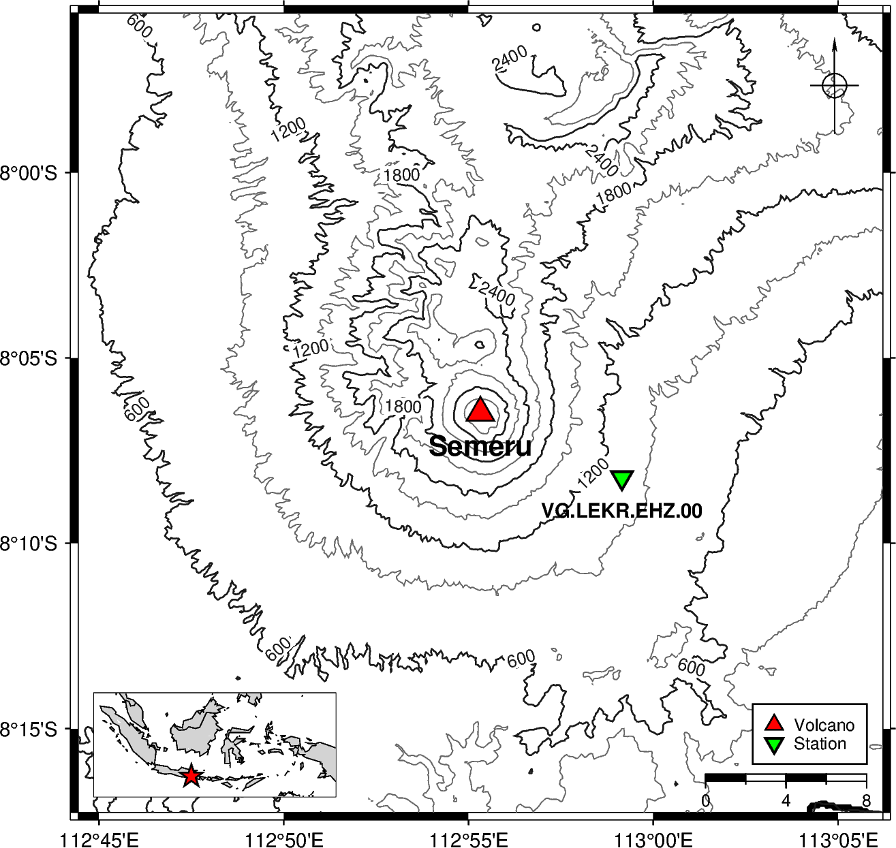
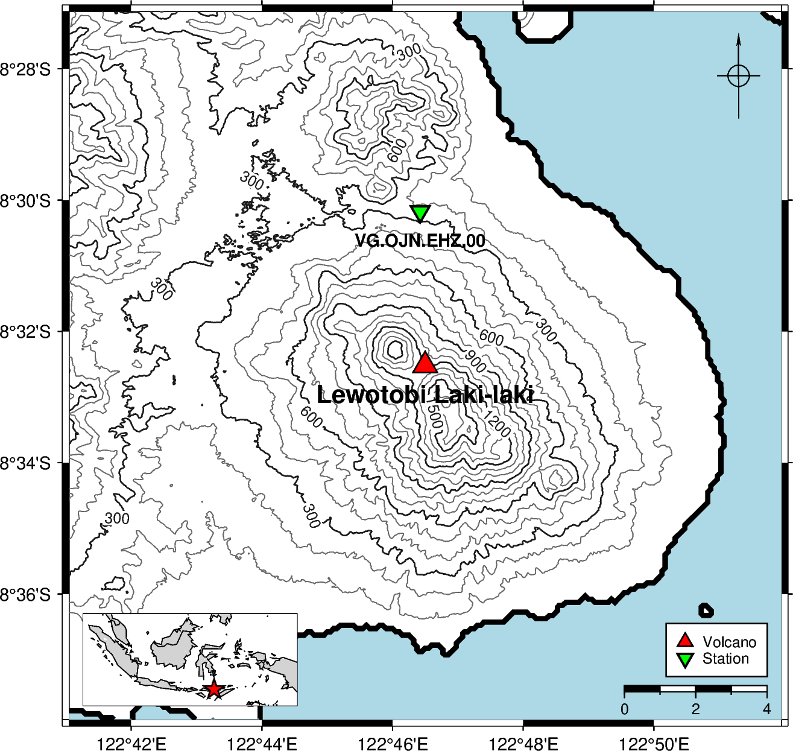

# volcano-pygmt


A Python package for plotting volcano maps using [PyGMT](https://www.pygmt.org). Generate scientific-quality maps with terrain relief, contours, seismic station markers, scale bars, north arrows, and country-level locator insets.

<table>
<tr>
  <td align="center">
    <a href="assets/semeru.png"></a>
    <br><b>Semeru</b> · East Java, Indonesia
    <br><sub>Contour interval 300 m · padding 20 km</sub>
  </td>
  <td align="center">
    <a href="assets/lewotobi-laki-laki.png"></a>
    <br><b>Lewotobi Laki-laki</b> · East Nusa Tenggara, Indonesia
    <br><sub>Contour interval 300 m · padding 10 km</sub>
  </td>
</tr>
</table>

## Table of Contents

- [Requirements](#requirements)
- [Configuration](#configuration)
- [Installation](#installation)
- [Quick Start](#quick-start)
- [Examples](#examples)
- [API Reference](#api-reference)
- [License](#license)

## Requirements

- **Python** `>=3.12`
- **uv** — Python package manager ([installation guide](https://docs.astral.sh/uv/getting-started/installation/))
- **GMT** (Generic Mapping Tools) — required by PyGMT ([download](https://www.generic-mapping-tools.org/download/), [troubleshooting](https://www.pygmt.org/latest/install.html#error-loading-gmt-shared-library-at))

## Configuration

> [!IMPORTANT]
> `GMT_LIBRARY_PATH` must be set in your environment **before** `pygmt` is imported. Importing PyGMT without it will raise a library-not-found error.

If PyGMT cannot find the GMT shared library at import time, set `GMT_LIBRARY_PATH` to the directory that contains the GMT shared library (`gmt_c.dll` on Windows, `libgmt.dylib` on macOS, `libgmt.so` on Linux).

### 1. Copy the example file

```bash
cp .env.example .env
```

Open `.env` in any text editor. It will look like this:

```env
GMT_LIBRARY_PATH=
```

Fill in the path to the directory containing the GMT shared library:

```env
GMT_LIBRARY_PATH=C:/Program Files/GMT6/bin
```

### 2. Edit `.env` and set the path

```env
GMT_LIBRARY_PATH=/path/to/gmt/lib
```

**Platform examples:**

| Platform | Typical value |
|----------|---------------|
| Windows | `C:/Program Files/GMT6/bin` |
| macOS (Homebrew) | `/opt/homebrew/lib` |
| Linux | `/usr/lib/x86_64-linux-gnu` |

> **Tip:** Run `gmt --version` in your terminal to confirm GMT is installed, then locate the library with `find / -name "libgmt*" 2>/dev/null` (Linux/macOS) or `where gmt` (Windows). The library lives in the same directory as (or adjacent to) the `gmt` executable.

### 3. How it works

The package calls `load_config()` automatically on import, which reads `.env` and injects `GMT_LIBRARY_PATH` into the process environment before PyGMT is imported. You do not need to set the variable globally in your shell — the `.env` file is enough.

If you need to load the configuration manually (e.g. in a standalone script that imports PyGMT directly), call `load_config()` before any PyGMT import:

```python
from volcano_pygmt.config import load_config

load_config()  # reads .env and sets GMT_LIBRARY_PATH

import pygmt  # now safe to import
```

## Installation

1. Clone the repository:

```bash
git clone https://github.com/martanto/volcano-pygmt.git
cd volcano-pygmt
```

2. Install dependencies with `uv`:

```bash
uv sync
```

This installs all runtime dependencies (`pygmt`, `loguru`, `dotenv`) and dev tools (`ruff`, `ty`, `pytest`, etc.).

## Quick Start

```python
from volcano_pygmt import simple_plot

maps = [
    {
        "padding_km": 20,
        "volcano": {"lon": 112.922, "lat": -8.108, "elev": 3672, "name": "Semeru"},
        "stations": {
            "VG.LEKR.EHZ.00": {"lat": -8.137244444, "lon": 112.9858444},
        },
        "contour": True,
        "contour_interval": 300.0,
        "contour_annotation": 600.0,
        "colorbar": True,
    },
]

files = simple_plot(maps)
print(files)  # [PosixPath('.../output/semeru.png')]
```

Output PNG files are saved to `./output/<volcano-name-slug>.png`.

See `main.py` for a more complete example with multiple volcanoes.

## Examples

### Multiple volcanoes in a batch

The following example (from `main.py`) plots three Indonesian volcanoes — Semeru, Lewotobi Laki-laki, and Ruang — each with one seismic station and contour lines:

```python
from volcano_pygmt import simple_plot

maps = [
    {
        "padding_km": 20,
        "volcano": {"lon": 112.922, "lat": -8.108, "elev": 3672, "name": "Semeru"},
        "stations": {
            "VG.LEKR.EHZ.00": {"lat": -8.137244444, "lon": 112.9858444},
        },
        "color_relief": False,
        "contour": True,
        "contour_interval": 300.0,
        "contour_annotation": 600.0,
        "colorbar": True,
    },
    {
        "padding_km": 10,
        "volcano": {
            "lon": 122.775,
            "lat": -8.542,
            "elev": 3672,
            "name": "Lewotobi Laki-laki",
        },
        "stations": {
            "VG.OJN.EHZ.00": {"lat": -8.502944444, "lon": 122.7737222},
        },
        "color_relief": False,
        "contour": True,
        "contour_interval": 300.0,
        "contour_annotation": 300.0,
        "colorbar": True,
    },
    {
        "padding_km": 5,
        "volcano": {"lon": 125.3667, "lat": 2.3031, "elev": 703, "name": "Ruang"},
        "stations": {
            "VG.RUA3.EHZ.00": {"lat": 2.3196, "lon": 125.3814},
        },
        "color_relief": False,
        "contour": True,
        "contour_interval": 200.0,
        "contour_annotation": 200.0,
        "colorbar": True,
    },
]

simple_plot(maps)
```

Run it with:

```bash
uv run main.py
```

### Single volcano with color relief and hillshade

```python
from volcano_pygmt.plot import create_figure

volcano = {"lon": 107.65, "lat": -6.9, "name": "Tangkuban Parahu"}

fig = create_figure(
    volcano,
    padding_km=10.0,
    hillshade=True,
    contour=True,
    contour_interval=100.0,
    color_relief=True,
    colorbar=True,
    relief_cmap="gmt/haxby",
)

fig.savefig("tangkuban-parahu.png")
```

## API Reference

### `simple_plot(maps)`

Batch-render a list of volcano map specs and save each as a PNG to `./output/<slug>.png`.

**Parameters:**

| Parameter | Type | Description |
|-----------|------|-------------|
| `maps` | `list[dict]` | List of map specification dicts (see keys below) |

**Returns:** `list[pathlib.Path]` — absolute paths to the saved PNG files, in input order.

**Map spec keys:**

| Key | Type | Default | Description |
|-----|------|---------|-------------|
| `volcano` | `dict` | required | Volcano info — must include `"lon"` (float), `"lat"` (float), `"name"` (str) |
| `padding_km` | `float` | required | Half-extent of the map around the volcano centre in kilometres |
| `stations` | `dict \| None` | `None` | Station codes mapped to `{"lon": float, "lat": float}`; omit or set `None` to skip |
| `country` | `str` | `"Indonesia"` | Country name for the locator inset (must be in `COUNTRY_REGIONS`) |
| `hillshade` | `bool` | `False` | Render a grayscale shaded-relief layer |
| `contour` | `bool` | `False` | Draw elevation contour lines |
| `contour_interval` | `float` | `100.0` | Spacing between contour lines in metres |
| `contour_annotation` | `float \| None` | `None` | Contour label interval in metres; defaults to `5 × contour_interval` when `None` |
| `color_relief` | `bool` | `False` | Render a colour-filled elevation image (requires `contour=True`) |
| `colorbar` | `bool` | `False` | Add an elevation colorbar (requires `color_relief=True`) |
| `relief_cmap` | `str` | `"gmt/haxby"` | GMT colormap for colour relief — any valid GMT CPT name (e.g. `"geo"`, `"topo"`, `"dem1"`, `"gray"`) |
| `show_title` | `bool` | `False` | Display the volcano name as the map title |

---

### `create_figure(volcano, stations, padding_km, ...)`

Create and return a fully composed `pygmt.Figure` for a single volcano. Includes coastlines, optional terrain relief, volcano and station symbols, a legend, a scale bar, a north-arrow rose, and a country-level locator inset.

**Parameters:**

| Parameter | Type | Default | Description |
|-----------|------|---------|-------------|
| `volcano` | `dict` | required | Must include `"lon"` (float), `"lat"` (float), `"name"` (str) |
| `stations` | `dict \| None` | `None` | Station codes mapped to `{"lon": float, "lat": float}`; omit or set `None` to skip |
| `padding_km` | `float` | `5.0` | Half-extent of the map around the volcano centre in kilometres |
| `country` | `str` | `"Indonesia"` | Country name for the locator inset |
| `hillshade` | `bool` | `False` | Render a grayscale shaded-relief layer |
| `contour` | `bool` | `False` | Draw elevation contour lines |
| `contour_interval` | `float` | `100.0` | Spacing between contour lines in metres |
| `contour_annotation` | `float \| None` | `None` | Contour label interval in metres; defaults to `5 × contour_interval` when `None` |
| `color_relief` | `bool` | `False` | Render a colour-filled elevation image (requires `contour=True`) |
| `colorbar` | `bool` | `False` | Add an elevation colorbar (requires `color_relief=True`) |
| `relief_cmap` | `str` | `"gmt/haxby"` | GMT colormap for colour relief |
| `show_title` | `bool` | `True` | Display the volcano name as the map title |

**Returns:** `pygmt.Figure` — fully rendered figure ready to save or display.

---

### `add_relief(fig, region, projection, ...)`

Download SRTM 3-arc-second earth relief for `region` and composite one or more terrain layers onto `fig`.

**Parameters:**

| Parameter | Type | Default | Description |
|-----------|------|---------|-------------|
| `fig` | `pygmt.Figure` | required | The PyGMT figure to draw on |
| `region` | `list[float]` | required | Map extent as `[lon_min, lon_max, lat_min, lat_max]` in decimal degrees |
| `projection` | `str` | required | PyGMT/GMT projection string, e.g. `"M10c"` |
| `hillshade` | `bool` | `False` | Render a grayscale shaded-relief layer (radiance 315°/45°, exponential normalisation) |
| `contour` | `bool` | `False` | Draw elevation contour lines |
| `contour_interval` | `float` | `100.0` | Spacing between contour lines in metres |
| `contour_annotation` | `float \| None` | `None` | Contour label interval in metres; defaults to `5 × contour_interval` when `None` |
| `color_relief` | `bool` | `False` | Render a colour-filled elevation image using `relief_cmap` (only applied when `contour=True`) |
| `colorbar` | `bool` | `False` | Add an elevation colorbar labelled in metres (requires `color_relief=True`) |
| `relief_cmap` | `str` | `"gmt/haxby"` | GMT colormap name for the colour-relief image |

**Returns:** `pygmt.Figure` — the same `fig` with the requested layers added in-place.

---

### `add_inset(fig, volcano, country)`

Add a country-level locator inset to the bottom-left corner of `fig`, with a red star marking the volcano position.

**Parameters:**

| Parameter | Type | Default | Description |
|-----------|------|---------|-------------|
| `fig` | `pygmt.Figure` | required | The PyGMT figure to add the inset to |
| `volcano` | `dict` | required | Must include `"lon"` (float) and `"lat"` (float) |
| `country` | `str` | `"Indonesia"` | Country name to look up in `COUNTRY_REGIONS` for the inset extent |

**Returns:** `pygmt.Figure` — the same `fig` with the inset added in-place.

**Raises:** `ValueError` — if `country` is not a key in `COUNTRY_REGIONS`.

## Development

```bash
# Run tests
uv run pytest

# Lint
uv run ruff check src/

# Auto-fix lint issues
uv run ruff check --fix src/

# Type check
uv run ty check

# Start Jupyter notebook
uv run jupyter notebook
```

## License

MIT — see [LICENSE](LICENSE) for details.
